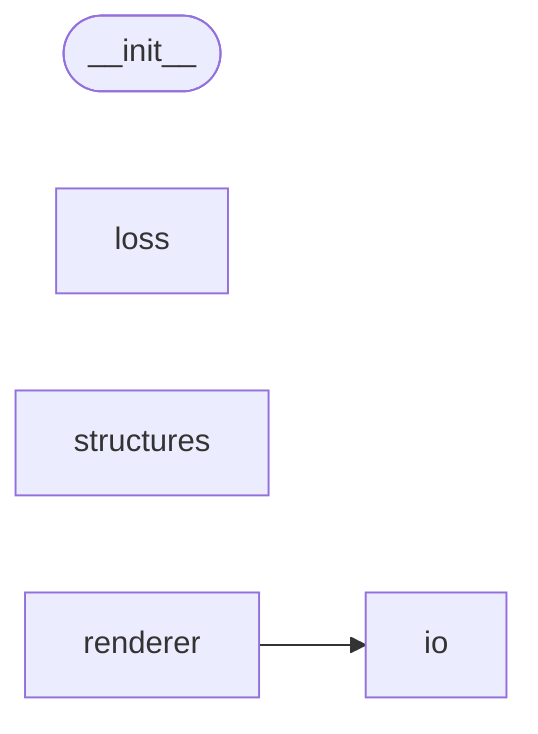

# Code Overview

[_Documentation generated by Documatic_](https://www.documatic.com)

<!---Documatic-section-Codebase Structure Python-start--->
## Codebase Structure Python

The codebase has a 4-deep folder structure,
                with 44 code files in total.

<!---Documatic-block-system_architecture-start--->

<!---Documatic-block-system_architecture-end--->

# #
<!---Documatic-section-Codebase Structure Python-end--->

<!---Documatic-section-Important Functions-start--->
## Important Functions

<!---Documatic-block-important_funcs-start--->
<!---Documatic-block-most_used_funcs-start--->
### Most Utilised Functions

* [jrender.io.utils.load_textures._load_textures_for_softras](4-jrender_io.md#jrender.io.utils.load_textures._load_textures_for_softras) (2 times)
* [jrender.renderer.dr.softras.soft_rasterize.soft_rasterize](5-jrender_renderer.md#jrender.renderer.dr.softras.soft_rasterize.soft_rasterize) (2 times)
* [jrender.renderer.dr.n3mr.n3mr.rasterize](5-jrender_renderer.md#jrender.renderer.dr.n3mr.n3mr.rasterize) (2 times)
* [jrender.renderer.dr.n3mr.n3mr.rasterize_depth](5-jrender_renderer.md#jrender.renderer.dr.n3mr.n3mr.rasterize_depth) (2 times)
* [jrender.renderer.dr.n3mr.n3mr.rasterize_rgbad](5-jrender_renderer.md#jrender.renderer.dr.n3mr.n3mr.rasterize_rgbad) (2 times)
* [jrender.renderer.dr.n3mr.n3mr.rasterize_silhouettes](5-jrender_renderer.md#jrender.renderer.dr.n3mr.n3mr.rasterize_silhouettes) (2 times)
* [jrender.loss.iou_loss.neg_iou_loss](3-jrender_loss.md#jrender.loss.iou_loss.neg_iou_loss) (1 times)
* [jrender.io.utils._load_obj_for_n3mr.load_obj](4-jrender_io.md#jrender.io.utils._load_obj_for_n3mr.load_obj) (1 times)
* [jrender.io.utils._load_obj_for_softras.load_obj](4-jrender_io.md#jrender.io.utils._load_obj_for_softras.load_obj) (1 times)
* [jrender.io.load_obj.load_obj](4-jrender_io.md#jrender.io.load_obj.load_obj) (1 times)
* [jrender.io.save_obj.create_texture_image](4-jrender_io.md#jrender.io.save_obj.create_texture_image) (1 times)
* [jrender.io.save_obj.save_obj](4-jrender_io.md#jrender.io.save_obj.save_obj) (1 times)
* [jrender.io.save_obj.save_voxel](4-jrender_io.md#jrender.io.save_obj.save_voxel) (1 times)
* [jrender.io.utils.load_textures._load_textures_for_n3mr](4-jrender_io.md#jrender.io.utils.load_textures._load_textures_for_n3mr) (1 times)
* [jrender.renderer.transform.look_at.look_at](5-jrender_renderer.md#jrender.renderer.transform.look_at.look_at) (1 times)
* [jrender.renderer.transform.look.look](5-jrender_renderer.md#jrender.renderer.transform.look.look) (1 times)
* [jrender.renderer.transform.orthogonal.orthogonal](5-jrender_renderer.md#jrender.renderer.transform.orthogonal.orthogonal) (1 times)
* [jrender.renderer.transform.perspective.perspective](5-jrender_renderer.md#jrender.renderer.transform.perspective.perspective) (1 times)
* [jrender.renderer.transform.projection.projection](5-jrender_renderer.md#jrender.renderer.transform.projection.projection) (1 times)
* [jrender.renderer.utils.gaussian_blur.gaussian_blur](5-jrender_renderer.md#jrender.renderer.utils.gaussian_blur.gaussian_blur) (1 times)
* [jrender.renderer.utils.ToStretchMap.computeStretchMap](5-jrender_renderer.md#jrender.renderer.utils.ToStretchMap.computeStretchMap) (1 times)
* [jrender.renderer.lighting.ambient_lighting.ambient_lighting](5-jrender_renderer.md#jrender.renderer.lighting.ambient_lighting.ambient_lighting) (1 times)
* [jrender.renderer.lighting.directional_lighting.directional_lighting](5-jrender_renderer.md#jrender.renderer.lighting.directional_lighting.directional_lighting) (1 times)
* [jrender.renderer.lighting.directional_lighting.fresnelSchlick](5-jrender_renderer.md#jrender.renderer.lighting.directional_lighting.fresnelSchlick) (1 times)
* [jrender.renderer.lighting.lighting.lighting](5-jrender_renderer.md#jrender.renderer.lighting.lighting.lighting) (1 times)
<!---Documatic-block-most_used_funcs-end--->
<!---Documatic-block-important_funcs-end--->

# #
<!---Documatic-section-Important Functions-end--->

<!---Documatic-section-File IO-start--->
## File IO

<!---Documatic-block-file_io-start--->
The following files have file read operations

<!---Documatic-block-jrender.io-start--->

	
<code>jrender.io</code> (Click to Expand!)

* jrender.io.utils._load_obj_for_n3mr
* jrender.io.utils._load_obj_for_softras

<!---Documatic-block-jrender.io-end--->

The following files have file write operations

<!---Documatic-block-jrender.io-start--->

	
<code>jrender.io</code> (Click to Expand!)

* jrender.io.save_obj

<!---Documatic-block-jrender.io-end--->
<!---Documatic-block-file_io-end--->

# #
<!---Documatic-section-File IO-end--->

<!---Documatic-section-Class Hierarchy-start--->
## Class Hierarchy

<!---Documatic-block-jrender.renderer.dr.softras.soft_rasterize.SoftRasterizeFunction-start--->

	
<code>jrender.renderer.dr.softras.soft_rasterize.SoftRasterizeFunction</code> (Click to Expand!)

* jrender.renderer.dr.n3mr.n3mr.RasterizeFunction
* [jrender.renderer.dr.softras.soft_rasterize.SoftRasterizeFunction](5-jrender_renderer.md#jrender.renderer.dr.softras.soft_rasterize.SoftRasterizeFunction)

<!---Documatic-block-jrender.renderer.dr.softras.soft_rasterize.SoftRasterizeFunction-end--->

<!---Documatic-block-nn.Module-start--->

	
<code>nn.Module</code> (Click to Expand!)

* jrender.loss.flatten_loss.FlattenLoss
* jrender.loss.laplacian_loss.LaplacianLoss
* jrender.renderer.lighting.lighting.AmbientLighting
* jrender.renderer.lighting.lighting.DirectionalLighting
* jrender.renderer.renderer.Renderer
* jrender.renderer.transform.transform.Look
* jrender.renderer.transform.transform.LookAt
* jrender.renderer.transform.transform.Projection
* jrender.renderer.transform.transform.Transform

<!---Documatic-block-nn.Module-end--->

# #
<!---Documatic-section-Class Hierarchy-end--->

[_Documentation generated by Documatic_](https://www.documatic.com)