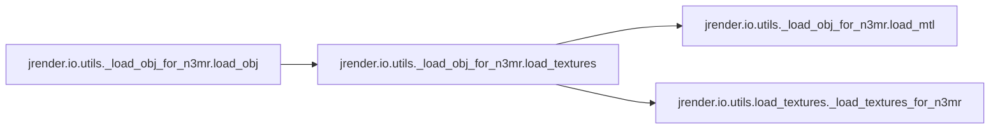
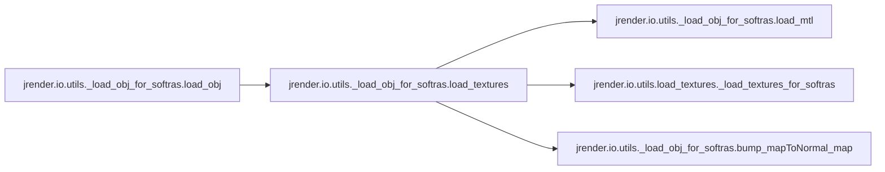
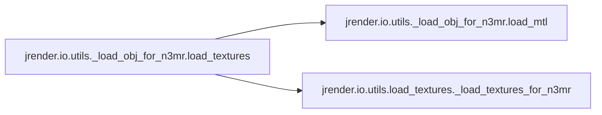
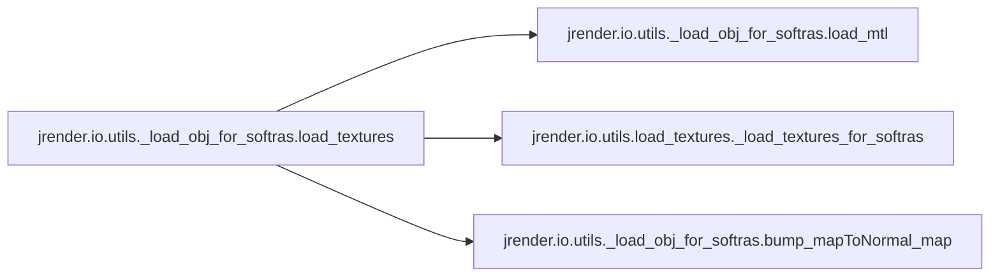

# Jrender Io

[_Documentation generated by Documatic_](https://www.documatic.com)

<!---Documatic-section-Codebase Structure-start--->
## Codebase Structure

<!---Documatic-block-system_architecture-start--->
```mermaid
None
```
<!---Documatic-block-system_architecture-end--->

# #
<!---Documatic-section-Codebase Structure-end--->

<!---Documatic-section-jrender.io.utils.load_textures._load_textures_for_softras-start--->
## [jrender.io.utils.load_textures._load_textures_for_softras](4-jrender_io.md#jrender.io.utils.load_textures._load_textures_for_softras)

<!---Documatic-section-_load_textures_for_softras-start--->
<!---Documatic-block-jrender.io.utils.load_textures._load_textures_for_softras-start--->
<details>
	<summary><code>jrender.io.utils.load_textures._load_textures_for_softras</code> code snippet</summary>

```python
def _load_textures_for_softras(image, faces, textures, is_update):
    return jt.code(textures.shape, textures.dtype, [image, faces, is_update], cuda_header='\n    #include <cuda.h>\n    #include <cuda_runtime.h>\n\n    namespace {\n    template <typename scalar_t>\n    __global__ void load_textures_cuda_kernel(\n        const scalar_t* __restrict__ image,\n        const scalar_t* __restrict__ faces,\n        const int32_t* __restrict__ is_update,\n        scalar_t* __restrict__ textures, \n        size_t texture_size,\n        size_t texture_res,\n        size_t image_height,\n        size_t image_width) {\n    const int i = blockIdx.x * blockDim.x + threadIdx.x;\n    if (i * 3 >= texture_size) {\n        return;\n    }\n    const int R = texture_res;\n    const int fn = i / (R * R);\n    const int w_y = (i % (R * R)) / R;\n    const int w_x = i % R;\n    // compute barycentric coordinate\n    scalar_t w0, w1, w2;\n    if (w_x + w_y < R) {\n        w0 = (w_x + 1. / 3.) / R;\n        w1 = (w_y + 1. / 3.) / R;\n        w2 = 1. - w0 - w1;\n    } else {\n        w0 = ((R - 1. - w_x) + 2. / 3.) / R;\n        w1 = ((R - 1. - w_y) + 2. / 3.) / R;\n        w2 = 1. - w0 - w1;\n    }\n    const scalar_t* face = &faces[fn * 3 * 2];\n    scalar_t* texture = &textures[i * 3];\n    if (is_update[fn] == 0) return;\n    \n    const scalar_t pos_x = (\n        (face[2 * 0 + 0] * w0 + face[2 * 1 + 0] * w1 + face[2 * 2 + 0] * w2) * (image_width - 1));\n    const scalar_t pos_y = (\n        (face[2 * 0 + 1] * w0 + face[2 * 1 + 1] * w1 + face[2 * 2 + 1] * w2) * (image_height - 1));\n    if (1) {\n        /* bilinear sampling */\n        const scalar_t weight_x1 = pos_x - (int)pos_x;\n        const scalar_t weight_x0 = 1 - weight_x1;\n        const scalar_t weight_y1 = pos_y - (int)pos_y;\n        const scalar_t weight_y0 = 1 - weight_y1;\n        for (int k = 0; k < 3; k++) {\n            scalar_t c = 0;\n            c += image[((int)pos_y * image_width + (int)pos_x) * 3 + k] * (weight_x0 * weight_y0);\n            c += image[((int)(pos_y + 1) * image_width + (int)pos_x) * 3 + k] * (weight_x0 * weight_y1);\n            c += image[((int)pos_y * image_width + ((int)pos_x) + 1) * 3 + k] * (weight_x1 * weight_y0);\n            c += image[((int)(pos_y + 1)* image_width + ((int)pos_x) + 1) * 3 + k] * (weight_x1 * weight_y1);\n            texture[k] = c;\n        }\n    } else {\n        /* nearest neighbor */\n        const int pos_xi = round(pos_x);\n        const int pos_yi = round(pos_y);\n        for (int k = 0; k < 3; k++) {\n            texture[k] = image[(pos_yi * image_width + pos_xi) * 3 + k];\n        }\n    }\n    }\n    }\n    ', cuda_src=f'\n    @alias(image, in0)\n    @alias(faces, in1)\n    @alias(is_update, in2)\n    @alias(textures, out0)\n    // texture_size = size of the textures tensor\n    const auto texture_size = textures->num;\n    // notice that texture_res != texture_res\n    const auto texture_res = sqrt(textures_shape1);\n    const auto image_height = image_shape0;\n    const auto image_width = image_shape1;\n    \n    const int threads = 1024;\n    const dim3 blocks ((texture_size / 3 - 1) / threads + 1);\n\n    load_textures_cuda_kernel<float32><<<blocks, threads>>>(\n        image_p,\n        faces_p,\n        is_update_p,\n        textures_p,\n        texture_size,\n        texture_res,\n        image_height,\n        image_width);\n\n    cudaError_t err = cudaGetLastError();\n    if (err != cudaSuccess) \n            printf("Error in load_textures: %s\\n", cudaGetErrorString(err));\n    ')
```
</details>
<!---Documatic-block-jrender.io.utils.load_textures._load_textures_for_softras-end--->
<!---Documatic-section-_load_textures_for_softras-end--->

# #
<!---Documatic-section-jrender.io.utils.load_textures._load_textures_for_softras-end--->

<!---Documatic-section-jrender.io.utils._load_obj_for_n3mr.load_obj-start--->
## [jrender.io.utils._load_obj_for_n3mr.load_obj](4-jrender_io.md#jrender.io.utils._load_obj_for_n3mr.load_obj)

<!---Documatic-section-load_obj-start--->


### Object Calls

* [jrender.io.utils._load_obj_for_n3mr.load_textures](4-jrender_io.md#jrender.io.utils._load_obj_for_n3mr.load_textures)

<!---Documatic-block-jrender.io.utils._load_obj_for_n3mr.load_obj-start--->
<details>
	<summary><code>jrender.io.utils._load_obj_for_n3mr.load_obj</code> code snippet</summary>

```python
def load_obj(filename_obj, normalization=True, texture_res=4, load_texture=False, texture_wrapping='REPEAT', use_bilinear=True):
    vertices = []
    with open(filename_obj) as f:
        lines = f.readlines()
    for line in lines:
        if len(line.split()) == 0:
            continue
        if line.split()[0] == 'v':
            vertices.append([float(v) for v in line.split()[1:4]])
    vertices = jt.array(vertices).float32()
    faces = []
    for line in lines:
        if len(line.split()) == 0:
            continue
        if line.split()[0] == 'f':
            vs = line.split()[1:]
            nv = len(vs)
            v0 = int(vs[0].split('/')[0])
            for i in range(nv - 2):
                v1 = int(vs[i + 1].split('/')[0])
                v2 = int(vs[i + 2].split('/')[0])
                faces.append((v0, v1, v2))
    faces = jt.array(np.vstack(faces).astype(np.int32)).float32() - 1
    textures = None
    if load_texture:
        for line in lines:
            if line.startswith('mtllib'):
                filename_mtl = os.path.join(os.path.dirname(filename_obj), line.split()[1])
                textures = load_textures(filename_obj, filename_mtl, texture_res, texture_wrapping=texture_wrapping, use_bilinear=use_bilinear)
        if textures is None:
            raise Exception('Failed to load textures.')
    if normalization:
        vertices -= vertices.min(0).unsqueeze(0)
        vertices /= jt.abs(vertices).max()
        vertices *= 2
        vertices -= vertices.max(0).unsqueeze(0) / 2
    if load_texture:
        return (vertices, faces, textures)
    else:
        return (vertices, faces)
```
</details>
<!---Documatic-block-jrender.io.utils._load_obj_for_n3mr.load_obj-end--->
<!---Documatic-section-load_obj-end--->

# #
<!---Documatic-section-jrender.io.utils._load_obj_for_n3mr.load_obj-end--->

<!---Documatic-section-jrender.io.utils._load_obj_for_softras.load_obj-start--->
## [jrender.io.utils._load_obj_for_softras.load_obj](4-jrender_io.md#jrender.io.utils._load_obj_for_softras.load_obj)

<!---Documatic-section-load_obj-start--->


### Object Calls

* [jrender.io.utils._load_obj_for_softras.load_textures](4-jrender_io.md#jrender.io.utils._load_obj_for_softras.load_textures)

<!---Documatic-block-jrender.io.utils._load_obj_for_softras.load_obj-start--->
<details>
	<summary><code>jrender.io.utils._load_obj_for_softras.load_obj</code> code snippet</summary>

```python
def load_obj(filename_obj, normalization=False, load_texture=False, texture_res=4, texture_type='surface'):
    assert texture_type in ['surface', 'vertex']
    vertices = []
    with open(filename_obj) as f:
        lines = f.readlines()
    for line in lines:
        if len(line.split()) == 0:
            continue
        if line.split()[0] == 'v':
            vertices.append([float(v) for v in line.split()[1:4]])
    vertices = jt.array(np.vstack(vertices)).float32()
    faces = []
    for line in lines:
        if len(line.split()) == 0:
            continue
        if line.split()[0] == 'f':
            vs = line.split()[1:]
            nv = len(vs)
            v0 = int(vs[0].split('/')[0])
            for i in range(nv - 2):
                v1 = int(vs[i + 1].split('/')[0])
                v2 = int(vs[i + 2].split('/')[0])
                faces.append((v0, v1, v2))
    faces = jt.array(np.vstack(faces).astype(np.int32)).float32() - 1
    if load_texture and texture_type == 'surface':
        textures = None
        normal_textures = None
        for line in lines:
            if line.startswith('mtllib'):
                filename_mtl = os.path.join(os.path.dirname(filename_obj), line.split()[1])
                face_vertices = vertices[faces]
                (textures, normal_textures, TBN, face_texcoords) = load_textures(filename_obj, filename_mtl, texture_res, face_vertices)
        if textures is None:
            raise Exception('Failed to load textures.')
    elif load_texture and texture_type == 'vertex':
        textures = []
        for line in lines:
            if len(line.split()) == 0:
                continue
            if line.split()[0] == 'v':
                textures.append([float(v) for v in line.split()[4:7]])
        textures = jt.array(np.vstack(textures)).float()
    if normalization:
        vertices -= vertices.min(0)
        vertices /= jt.abs(vertices).max()
        vertices *= 2
        vertices -= vertices.max(0) / 2
    if load_texture:
        return (vertices, faces, textures, normal_textures, TBN, face_texcoords)
    else:
        return (vertices, faces)
```
</details>
<!---Documatic-block-jrender.io.utils._load_obj_for_softras.load_obj-end--->
<!---Documatic-section-load_obj-end--->

# #
<!---Documatic-section-jrender.io.utils._load_obj_for_softras.load_obj-end--->

<!---Documatic-section-jrender.io.load_obj.load_obj-start--->
## [jrender.io.load_obj.load_obj](4-jrender_io.md#jrender.io.load_obj.load_obj)

<!---Documatic-section-load_obj-start--->
<!---Documatic-block-jrender.io.load_obj.load_obj-start--->
<details>
	<summary><code>jrender.io.load_obj.load_obj</code> code snippet</summary>

```python
def load_obj(filename_obj, normalization=False, load_texture=False, dr_type='softras', texture_res=4, texture_type='surface', texture_wrapping='REPEAT', use_bilinear=True):
    assert dr_type in ['softras', 'n3mr']
    if dr_type == 'softras':
        return load_obj_for_softras(filename_obj, normalization=normalization, load_texture=load_texture, texture_res=texture_res, texture_type=texture_type)
    elif dr_type == 'n3mr':
        return load_obj_for_n3mr(filename_obj, normalization=normalization, texture_res=texture_res, load_texture=load_texture, texture_wrapping=texture_wrapping, use_bilinear=use_bilinear)
```
</details>
<!---Documatic-block-jrender.io.load_obj.load_obj-end--->
<!---Documatic-section-load_obj-end--->

# #
<!---Documatic-section-jrender.io.load_obj.load_obj-end--->

<!---Documatic-section-jrender.io.save_obj.create_texture_image-start--->
## [jrender.io.save_obj.create_texture_image](4-jrender_io.md#jrender.io.save_obj.create_texture_image)

<!---Documatic-section-create_texture_image-start--->
<!---Documatic-block-jrender.io.save_obj.create_texture_image-start--->
<details>
	<summary><code>jrender.io.save_obj.create_texture_image</code> code snippet</summary>

```python
def create_texture_image(textures, texture_res=16):
    num_faces = textures.shape[0]
    tile_width = int((num_faces - 1.0) ** 0.5) + 1
    tile_height = int((num_faces - 1.0) / tile_width) + 1
    image = jt.ones((tile_height * texture_res, tile_width * texture_res, 3))
    vertices = jt.zeros((num_faces, 3, 2))
    face_nums = jt.array(np.arange(num_faces))
    column = face_nums % tile_width
    row = face_nums / tile_width
    vertices[:, 0, 0] = column * texture_res + texture_res / 2
    vertices[:, 0, 1] = row * texture_res + 1
    vertices[:, 1, 0] = column * texture_res + 1
    vertices[:, 1, 1] = (row + 1) * texture_res - 1 - 1
    vertices[:, 2, 0] = (column + 1) * texture_res - 1 - 1
    vertices[:, 2, 1] = (row + 1) * texture_res - 1 - 1
    image = create_texture_image_cuda.create_texture_image(vertices, textures, image, 1e-05)
    vertices[:, :, 0] /= image.shape[1] - 1
    vertices[:, :, 1] /= image.shape[0] - 1
    image = image.numpy()
    vertices = vertices.numpy()
    image = image[::-1, ::1]
    return (image, vertices)
```
</details>
<!---Documatic-block-jrender.io.save_obj.create_texture_image-end--->
<!---Documatic-section-create_texture_image-end--->

# #
<!---Documatic-section-jrender.io.save_obj.create_texture_image-end--->

<!---Documatic-section-jrender.io.save_obj.save_obj-start--->
## [jrender.io.save_obj.save_obj](4-jrender_io.md#jrender.io.save_obj.save_obj)

<!---Documatic-section-save_obj-start--->


### Object Calls

* [jrender.io.save_obj.create_texture_image](4-jrender_io.md#jrender.io.save_obj.create_texture_image)

<!---Documatic-block-jrender.io.save_obj.save_obj-start--->
<details>
	<summary><code>jrender.io.save_obj.save_obj</code> code snippet</summary>

```python
def save_obj(filename, vertices, faces, textures=None, texture_res=16, texture_type='surface'):
    assert len(vertices.shape) == 2
    assert len(faces.shape) == 2
    assert texture_type in ['surface', 'vertex']
    assert texture_res >= 2
    filename_mtl = filename[:-4] + '.mtl'
    if textures is not None and texture_type == 'surface':
        filename_texture = filename[:-4] + '.png'
        material_name = 'material_1'
        (texture_image, vertices_textures) = create_texture_image(textures, texture_res)
        texture_image = texture_image.clip(0, 1)
        texture_image = (texture_image * 255).astype('uint8')
        imsave(filename_texture, texture_image)
    faces = faces.numpy()
    vertices = vertices.numpy()
    with open(filename, 'w') as f:
        f.write('# %s\n' % os.path.basename(filename))
        f.write('#\n')
        f.write('\n')
        if textures is not None:
            f.write('mtllib %s\n\n' % os.path.basename(filename_mtl))
        if textures is not None and texture_type == 'vertex':
            for (vertex, color) in zip(vertices, textures):
                f.write('v %.8f %.8f %.8f %.8f %.8f %.8f\n' % (vertex[0], vertex[1], vertex[2], color[0], color[1], color[2]))
            f.write('\n')
        else:
            for vertex in vertices:
                f.write('v %.8f %.8f %.8f\n' % (vertex[0], vertex[1], vertex[2]))
            f.write('\n')
        if textures is not None and texture_type == 'surface':
            for vertex in vertices_textures.reshape((-1, 2)):
                f.write('vt %.8f %.8f\n' % (vertex[0], vertex[1]))
            f.write('\n')
            f.write('usemtl %s\n' % material_name)
            for (i, face) in enumerate(faces):
                f.write('f %d/%d %d/%d %d/%d\n' % (face[0] + 1, 3 * i + 1, face[1] + 1, 3 * i + 2, face[2] + 1, 3 * i + 3))
            f.write('\n')
        else:
            for face in faces:
                f.write('f %d %d %d\n' % (face[0] + 1, face[1] + 1, face[2] + 1))
    if textures is not None and texture_type == 'surface':
        with open(filename_mtl, 'w') as f:
            f.write('newmtl %s\n' % material_name)
            f.write('map_Kd %s\n' % os.path.basename(filename_texture))
```
</details>
<!---Documatic-block-jrender.io.save_obj.save_obj-end--->
<!---Documatic-section-save_obj-end--->

# #
<!---Documatic-section-jrender.io.save_obj.save_obj-end--->

<!---Documatic-section-jrender.io.save_obj.save_voxel-start--->
## [jrender.io.save_obj.save_voxel](4-jrender_io.md#jrender.io.save_obj.save_voxel)

<!---Documatic-section-save_voxel-start--->


### Object Calls

* [jrender.io.save_obj.save_obj](4-jrender_io.md#jrender.io.save_obj.save_obj)

<!---Documatic-block-jrender.io.save_obj.save_voxel-start--->
<details>
	<summary><code>jrender.io.save_obj.save_voxel</code> code snippet</summary>

```python
def save_voxel(filename, voxel):
    vertices = []
    for i in range(voxel.shape[0]):
        for j in range(voxel.shape[1]):
            for k in range(voxel.shape[2]):
                if voxel[i, j, k] == 1:
                    vertices.append([i / voxel.shape[0], j / voxel.shape[1], k / voxel.shape[2]])
    vertices = jt.array(vertices)
    return save_obj(filename, vertices, jt.array([]))
```
</details>
<!---Documatic-block-jrender.io.save_obj.save_voxel-end--->
<!---Documatic-section-save_voxel-end--->

# #
<!---Documatic-section-jrender.io.save_obj.save_voxel-end--->

<!---Documatic-section-jrender.io.utils.load_textures._load_textures_for_n3mr-start--->
## [jrender.io.utils.load_textures._load_textures_for_n3mr](4-jrender_io.md#jrender.io.utils.load_textures._load_textures_for_n3mr)

<!---Documatic-section-_load_textures_for_n3mr-start--->
<!---Documatic-block-jrender.io.utils.load_textures._load_textures_for_n3mr-start--->
<details>
	<summary><code>jrender.io.utils.load_textures._load_textures_for_n3mr</code> code snippet</summary>

```python
def _load_textures_for_n3mr(image, faces, textures, is_update, texture_wrapping, use_bilinear):
    return jt.code(textures.shape, textures.dtype, [image, faces, is_update], cuda_header='\n    #include <cuda.h>\n    #include <cuda_runtime.h>\n\n    template <typename scalar_t>\n    static __inline__ __device__ scalar_t mod(scalar_t x, scalar_t y) {\n        if (x > 0) {\n            return fmod(x,y);\n        }\n        else {\n            return y + fmod(x,y);\n        }\n    }\n\n    namespace {\n\n    const int REPEAT = 0;\n    const int MIRRORED_REPEAT = 1;\n    const int CLAMP_TO_EDGE = 2;\n    const int CLAMP_TO_BORDER = 3;\n\n    template <typename scalar_t>\n    __global__ void load_textures_cuda_kernel(\n        const scalar_t* image,\n        const int32_t* is_update,\n        scalar_t* faces,\n        scalar_t* __restrict__ textures, \n        int textures_size,\n        int texture_size,\n        int image_height,\n        int image_width) {\n    const int i = blockIdx.x * blockDim.x + threadIdx.x;\n    if (i >= textures_size / 3) {\n        return;\n    }\n    const int ts = texture_size;\n    const int fn = i / (ts * ts * ts);\n    scalar_t dim0 = ((i / (ts * ts)) % ts) / (ts - 1.) ;\n    scalar_t dim1 = ((i / ts) % ts) / (ts - 1.);\n    scalar_t dim2 = (i % ts) / (ts - 1.);\n    if (0 < dim0 + dim1 + dim2) {\n        float sum = dim0 + dim1 + dim2;\n        dim0 /= sum;\n        dim1 /= sum;\n        dim2 /= sum;\n    }\n    scalar_t* face = &faces[fn * 3 * 2];\n    scalar_t* texture_ = &textures[i * 3];\n\n    if (is_update[fn] != 0) {\n        if (texture_wrapping == REPEAT) {\n            #pragma unroll\n            for (int i = 0; i < 6; ++i) {\n                face[i] = mod(face[i], (scalar_t)1.);\n            }\n        }\n        else if (texture_wrapping == MIRRORED_REPEAT) {\n            #pragma unroll\n            for (int i = 0; i < 6; ++i) {\n                if (mod(face[i], (scalar_t)2) < 1) {\n                    face[i] = mod(face[i], (scalar_t)1.);\n                }\n                else {\n                    face[i] = 1 - mod(face[i], (scalar_t)1.);\n                }\n            }\n        }\n        else if (texture_wrapping == CLAMP_TO_EDGE) {\n            #pragma unroll\n            for (int i = 0; i < 6; ++i) {\n                face[i] = max(min(face[i], (scalar_t) 1), (scalar_t) 0);\n            }\n        }\n        const scalar_t pos_x = (\n            (face[2 * 0 + 0] * dim0 + face[2 * 1 + 0] * dim1 + face[2 * 2 + 0] * dim2) * (image_width - 1));\n        const scalar_t pos_y = (\n            (face[2 * 0 + 1] * dim0 + face[2 * 1 + 1] * dim1 + face[2 * 2 + 1] * dim2) * (image_height - 1));\n        if (use_bilinear) {\n            /* bilinear sampling */\n            const scalar_t weight_x1 = pos_x - (int)pos_x;\n            const scalar_t weight_x0 = 1 - weight_x1;\n            const scalar_t weight_y1 = pos_y - (int)pos_y;\n            const scalar_t weight_y0 = 1 - weight_y1;\n            for (int k = 0; k < 3; k++) {\n                if (texture_wrapping != CLAMP_TO_BORDER) {\n                    scalar_t c = 0;\n                    c += image[(int)pos_y * image_width * 3 + (int)pos_x * 3 + k] * (weight_x0 * weight_y0);\n                    c += image[min((int)(pos_y + 1), image_height-1) * image_width * 3 + (int)pos_x * 3 + k] * (weight_x0 * weight_y1);\n                    c += image[(int)pos_y * image_width * 3 + min((int)pos_x + 1, image_width-1) * 3 + k] * (weight_x1 * weight_y0);\n                    c += image[min((int)(pos_y + 1), image_height-1) * image_width * 3 + min((int)pos_x + 1, image_width-1) * 3 + k] * (weight_x1 * weight_y1);\n                    texture_[k] = c;\n                }\n                else {\n                    texture_[k] = 0;\n                }\n            }\n        } else {\n            /* nearest neighbor */\n            const int pos_xi = round(pos_x);\n            const int pos_yi = round(pos_y);\n            for (int k = 0; k < 3; k++) {\n                if (texture_wrapping != CLAMP_TO_BORDER) {\n                    texture_[k] = image[pos_yi * image_width * 3 + pos_xi * 3 + k];\n                }\n                else {\n                    texture_[k] = 0;\n                }\n            }\n        }\n    }\n    }\n    }\n    '.replace('texture_wrapping', str(texture_wrapping)).replace('use_bilinear', str(use_bilinear)), cuda_src='\n    @alias(image, in0)\n    @alias(faces, in1)\n    @alias(is_update, in2)\n    @alias(textures, out0)\n    // textures_size = size of the textures tensor\n    const auto textures_size = textures->num;\n    // notice that texture_size != texture_size\n    const auto texture_size = textures_shape1;\n    const auto image_height = image_shape0;\n    const auto image_width = image_shape1;\n    \n    const int threads = 1024;\n    const dim3 blocks ((textures_size / 3 - 1) / threads + 1);\n\n    load_textures_cuda_kernel<float32><<<blocks, threads>>>(\n        image_p,\n        is_update_p,\n        faces_p,\n        textures_p,\n        textures_size,\n        texture_size,\n        image_height,\n        image_width);\n\n    cudaError_t err = cudaGetLastError();\n    if (err != cudaSuccess) \n        printf("Error in load_textures: %s\\n", cudaGetErrorString(err));\n    ')
```
</details>
<!---Documatic-block-jrender.io.utils.load_textures._load_textures_for_n3mr-end--->
<!---Documatic-section-_load_textures_for_n3mr-end--->

# #
<!---Documatic-section-jrender.io.utils.load_textures._load_textures_for_n3mr-end--->

<!---Documatic-section-jrender.io.utils._load_obj_for_n3mr.load_textures-start--->
## [jrender.io.utils._load_obj_for_n3mr.load_textures](4-jrender_io.md#jrender.io.utils._load_obj_for_n3mr.load_textures)

<!---Documatic-section-load_textures-start--->


### Object Calls

* jrender.io.utils._load_obj_for_n3mr.load_mtl
* [jrender.io.utils.load_textures._load_textures_for_n3mr](4-jrender_io.md#jrender.io.utils.load_textures._load_textures_for_n3mr)

<!---Documatic-block-jrender.io.utils._load_obj_for_n3mr.load_textures-start--->
<details>
	<summary><code>jrender.io.utils._load_obj_for_n3mr.load_textures</code> code snippet</summary>

```python
def load_textures(filename_obj, filename_mtl, texture_res, texture_wrapping='REPEAT', use_bilinear=True):
    vertices = []
    with open(filename_obj) as f:
        lines = f.readlines()
    for line in lines:
        if len(line.split()) == 0:
            continue
        if line.split()[0] == 'vt':
            vertices.append([float(v) for v in line.split()[1:3]])
    vertices = np.vstack(vertices).astype(np.float32)
    faces = []
    material_names = []
    material_name = ''
    for line in lines:
        if len(line.split()) == 0:
            continue
        if line.split()[0] == 'f':
            vs = line.split()[1:]
            nv = len(vs)
            if '/' in vs[0] and '//' not in vs[0]:
                v0 = int(vs[0].split('/')[1])
            else:
                v0 = 0
            for i in range(nv - 2):
                if '/' in vs[i + 1] and '//' not in vs[i + 1]:
                    v1 = int(vs[i + 1].split('/')[1])
                else:
                    v1 = 0
                if '/' in vs[i + 2] and '//' not in vs[i + 2]:
                    v2 = int(vs[i + 2].split('/')[1])
                else:
                    v2 = 0
                faces.append((v0, v1, v2))
                material_names.append(material_name)
        if line.split()[0] == 'usemtl':
            material_name = line.split()[1]
    faces = np.vstack(faces).astype(np.int32) - 1
    faces = vertices[faces]
    faces = jt.array(faces).float32()
    (colors, texture_filenames) = load_mtl(filename_mtl)
    textures = jt.zeros((faces.shape[0], texture_res, texture_res, texture_res, 3), dtype='float32') + 0.5
    for (material_name, color) in colors.items():
        color = jt.array(color).float32()
        for (i, material_name_f) in enumerate(material_names):
            if material_name == material_name_f:
                textures[i, :, :, :, :] = color[None, None, None, :]
    for (material_name, filename_texture) in texture_filenames.items():
        filename_texture = os.path.join(os.path.dirname(filename_obj), filename_texture)
        image = imread(filename_texture).astype(np.float32) / 255.0
        if len(image.shape) == 2:
            image = np.stack((image,) * 3, -1)
        if image.shape[2] == 4:
            image = image[:, :, :3]
        image = image[::-1, :, :]
        image = jt.array(image.copy()).float32()
        is_update = (np.array(material_names) == material_name).astype(np.int32)
        is_update = jt.array(is_update)
        textures = _load_textures_for_n3mr(image, faces, textures, is_update, texture_wrapping_dict[texture_wrapping], int(use_bilinear))
    return textures
```
</details>
<!---Documatic-block-jrender.io.utils._load_obj_for_n3mr.load_textures-end--->
<!---Documatic-section-load_textures-end--->

# #
<!---Documatic-section-jrender.io.utils._load_obj_for_n3mr.load_textures-end--->

<!---Documatic-section-jrender.io.utils._load_obj_for_softras.load_textures-start--->
## [jrender.io.utils._load_obj_for_softras.load_textures](4-jrender_io.md#jrender.io.utils._load_obj_for_softras.load_textures)

<!---Documatic-section-load_textures-start--->


### Object Calls

* jrender.io.utils._load_obj_for_softras.load_mtl
* [jrender.io.utils.load_textures._load_textures_for_softras](4-jrender_io.md#jrender.io.utils.load_textures._load_textures_for_softras)
* jrender.io.utils._load_obj_for_softras.bump_mapToNormal_map

<!---Documatic-block-jrender.io.utils._load_obj_for_softras.load_textures-start--->
<details>
	<summary><code>jrender.io.utils._load_obj_for_softras.load_textures</code> code snippet</summary>

```python
def load_textures(filename_obj, filename_mtl, texture_res, face_vertices=None):
    vertices = []
    with open(filename_obj) as f:
        lines = f.readlines()
    for line in lines:
        if len(line.split()) == 0:
            continue
        if line.split()[0] == 'vt':
            vertices.append([float(v) for v in line.split()[1:3]])
    vertices = np.vstack(vertices).astype(np.float32)
    faces = []
    material_names = []
    material_name = ''
    for line in lines:
        if len(line.split()) == 0:
            continue
        if line.split()[0] == 'f':
            vs = line.split()[1:]
            nv = len(vs)
            if '/' in vs[0] and '//' not in vs[0]:
                v0 = int(vs[0].split('/')[1])
            else:
                v0 = 0
            for i in range(nv - 2):
                if '/' in vs[i + 1] and '//' not in vs[i + 1]:
                    v1 = int(vs[i + 1].split('/')[1])
                else:
                    v1 = 0
                if '/' in vs[i + 2] and '//' not in vs[i + 2]:
                    v2 = int(vs[i + 2].split('/')[1])
                else:
                    v2 = 0
                faces.append((v0, v1, v2))
                material_names.append(material_name)
        if line.split()[0] == 'usemtl':
            material_name = line.split()[1]
    faces = np.vstack(faces).astype(np.int32) - 1
    faces = vertices[faces]
    faces = jt.array(faces).float32()
    (colors, texture_filenames, normal_filenames) = load_mtl(filename_mtl)
    textures = jt.ones((faces.shape[0], texture_res ** 2, 3), dtype='float32')
    normal_textures = jt.ones((faces.shape[0], texture_res ** 2, 3), dtype='float32')
    TBN = jt.ones((faces.shape[0], 3, 3), dtype='float32')
    for (material_name, color) in colors.items():
        color = jt.array(color).float32()
        for (i, material_name_f) in enumerate(material_names):
            if material_name == material_name_f:
                textures[i, :, :] = color.unsqueeze(0)
    for (material_name, filename_texture) in texture_filenames.items():
        filename_texture = os.path.join(os.path.dirname(filename_obj), filename_texture)
        image = imread(filename_texture).astype(np.float32) / 255.0
        if len(image.shape) == 2:
            image = np.stack((image,) * 3, -1)
        if image.shape[2] == 4:
            image = image[:, :, :3]
        image = image[::-1, :, :]
        image = jt.array(image.copy()).float32()
        is_update = (np.array(material_names) == material_name).astype(np.int32)
        is_update = jt.array(is_update).int()
        textures = _load_textures_for_softras(image, faces, textures, is_update)
    if len(normal_filenames) == 0:
        normal_textures = None
        TBN = None
    else:
        for (normal_type, filename_normal) in normal_filenames.items():
            filename_normal = os.path.join(os.path.dirname(filename_obj), filename_normal)
            image = imread(filename_normal).astype(np.float32) / 255.0
            if normal_type == 'bump_map':
                image = bump_mapToNormal_map(image)
                filename_bumpToNormal = os.path.join(os.path.dirname(filename_obj), 'normal_high.jpg')
                imwrite(filename_bumpToNormal, np.array(image[:, :, ::-1]) * 255.0)
            e1 = face_vertices[:, 0] - face_vertices[:, 1]
            e2 = face_vertices[:, 0] - face_vertices[:, 2]
            n = jt.normalize(jt.cross(e1, e2).unsqueeze(1), dim=2)
            u1 = faces[:, 0, 0] - faces[:, 1, 0]
            v1 = faces[:, 0, 1] - faces[:, 1, 1]
            u2 = faces[:, 0, 0] - faces[:, 2, 0]
            v2 = faces[:, 0, 1] - faces[:, 2, 1]
            denom = jt.array(1 / (u1 * v2 - u2 * v1)).float32().unsqueeze(1).unsqueeze(2)
            inverse = jt.array(np.stack((np.stack((v2, -v1), axis=1), np.stack((-u2, u1), axis=1)), axis=1)).float32()
            e = jt.array(np.stack((e1, e2), axis=1)).float32()
            TB = jt.matmul(inverse, e)
            TB = denom * TB
            T = TB[:, 0, :]
            T = T.unsqueeze(1)
            T_n = jt.sum(T * n, dim=2).unsqueeze(1)
            T = T - T_n * n
            T = jt.normalize(T, dim=2)
            B = jt.normalize(jt.cross(n, T), dim=2)
            TBN = jt.concat([T, B, n], dim=1)
            is_update = jt.ones(len(material_names)).int()
            image = image[::-1, :, :]
            normal_textures = _load_textures_for_softras(image, faces, normal_textures, is_update)
            normal_textures = jt.normalize(normal_textures * 2 - 1, dim=2)
    return (textures, normal_textures, TBN, faces)
```
</details>
<!---Documatic-block-jrender.io.utils._load_obj_for_softras.load_textures-end--->
<!---Documatic-section-load_textures-end--->

# #
<!---Documatic-section-jrender.io.utils._load_obj_for_softras.load_textures-end--->

[_Documentation generated by Documatic_](https://www.documatic.com)