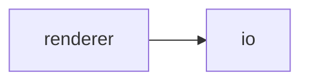
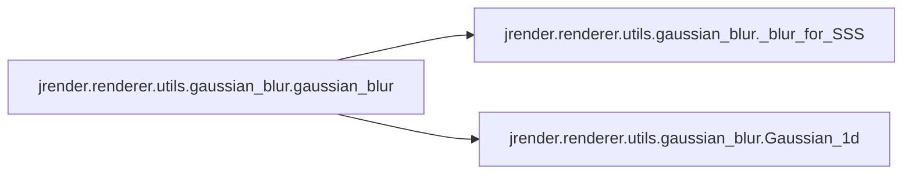
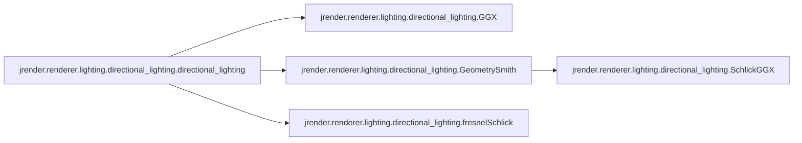

# Jrender Renderer

[_Documentation generated by Documatic_](https://www.documatic.com)

<!---Documatic-section-Codebase Structure-start--->
## Codebase Structure

<!---Documatic-block-system_architecture-start--->

<!---Documatic-block-system_architecture-end--->

# #
<!---Documatic-section-Codebase Structure-end--->

<!---Documatic-section-jrender.renderer.dr.softras.soft_rasterize.soft_rasterize-start--->
## [jrender.renderer.dr.softras.soft_rasterize.soft_rasterize](5-jrender_renderer.md#jrender.renderer.dr.softras.soft_rasterize.soft_rasterize)

<!---Documatic-section-soft_rasterize-start--->


### Object Calls

* [jrender.renderer.dr.softras.soft_rasterize.SoftRasterizeFunction](5-jrender_renderer.md#jrender.renderer.dr.softras.soft_rasterize.SoftRasterizeFunction)

<!---Documatic-block-jrender.renderer.dr.softras.soft_rasterize.soft_rasterize-start--->
<details>
	<summary><code>jrender.renderer.dr.softras.soft_rasterize.soft_rasterize</code> code snippet</summary>

```python
def soft_rasterize(face_vertices, textures, image_size=256, background_color=[0, 0, 0], near=1, far=100, fill_back=True, eps=0.001, sigma_val=1e-05, dist_func='euclidean', dist_eps=0.0001, gamma_val=0.0001, aggr_func_rgb='softmax', aggr_func_alpha='prod', texture_type='surface'):
    return SoftRasterizeFunction(image_size, background_color, near, far, fill_back, eps, sigma_val, dist_func, dist_eps, gamma_val, aggr_func_rgb, aggr_func_alpha, texture_type)(face_vertices, textures)
```
</details>
<!---Documatic-block-jrender.renderer.dr.softras.soft_rasterize.soft_rasterize-end--->
<!---Documatic-section-soft_rasterize-end--->

# #
<!---Documatic-section-jrender.renderer.dr.softras.soft_rasterize.soft_rasterize-end--->

<!---Documatic-section-jrender.renderer.dr.n3mr.n3mr.rasterize-start--->
## [jrender.renderer.dr.n3mr.n3mr.rasterize](5-jrender_renderer.md#jrender.renderer.dr.n3mr.n3mr.rasterize)

<!---Documatic-section-rasterize-start--->


### Object Calls

* [jrender.renderer.dr.n3mr.n3mr.rasterize_rgbad](5-jrender_renderer.md#jrender.renderer.dr.n3mr.n3mr.rasterize_rgbad)

<!---Documatic-block-jrender.renderer.dr.n3mr.n3mr.rasterize-start--->
<details>
	<summary><code>jrender.renderer.dr.n3mr.n3mr.rasterize</code> code snippet</summary>

```python
def rasterize(faces, textures, image_size=DEFAULT_IMAGE_SIZE, anti_aliasing=DEFAULT_ANTI_ALIASING, near=DEFAULT_NEAR, far=DEFAULT_FAR, eps=DEFAULT_EPS, background_color=DEFAULT_BACKGROUND_COLOR):
    return rasterize_rgbad(faces, textures, image_size, anti_aliasing, near, far, eps, background_color, True, False, False)['rgb']
```
</details>
<!---Documatic-block-jrender.renderer.dr.n3mr.n3mr.rasterize-end--->
<!---Documatic-section-rasterize-end--->

# #
<!---Documatic-section-jrender.renderer.dr.n3mr.n3mr.rasterize-end--->

<!---Documatic-section-jrender.renderer.dr.n3mr.n3mr.rasterize_depth-start--->
## [jrender.renderer.dr.n3mr.n3mr.rasterize_depth](5-jrender_renderer.md#jrender.renderer.dr.n3mr.n3mr.rasterize_depth)

<!---Documatic-section-rasterize_depth-start--->


### Object Calls

* [jrender.renderer.dr.n3mr.n3mr.rasterize_rgbad](5-jrender_renderer.md#jrender.renderer.dr.n3mr.n3mr.rasterize_rgbad)

<!---Documatic-block-jrender.renderer.dr.n3mr.n3mr.rasterize_depth-start--->
<details>
	<summary><code>jrender.renderer.dr.n3mr.n3mr.rasterize_depth</code> code snippet</summary>

```python
def rasterize_depth(faces, image_size=DEFAULT_IMAGE_SIZE, anti_aliasing=DEFAULT_ANTI_ALIASING, near=DEFAULT_NEAR, far=DEFAULT_FAR, eps=DEFAULT_EPS):
    return rasterize_rgbad(faces, None, image_size, anti_aliasing, near, far, eps, None, False, False, True)['depth']
```
</details>
<!---Documatic-block-jrender.renderer.dr.n3mr.n3mr.rasterize_depth-end--->
<!---Documatic-section-rasterize_depth-end--->

# #
<!---Documatic-section-jrender.renderer.dr.n3mr.n3mr.rasterize_depth-end--->

<!---Documatic-section-jrender.renderer.dr.n3mr.n3mr.rasterize_rgbad-start--->
## [jrender.renderer.dr.n3mr.n3mr.rasterize_rgbad](5-jrender_renderer.md#jrender.renderer.dr.n3mr.n3mr.rasterize_rgbad)

<!---Documatic-section-rasterize_rgbad-start--->


### Object Calls

* [jrender.renderer.dr.n3mr.n3mr.Rasterize](5-jrender_renderer.md#jrender.renderer.dr.n3mr.n3mr.Rasterize)

<!---Documatic-block-jrender.renderer.dr.n3mr.n3mr.rasterize_rgbad-start--->
<details>
	<summary><code>jrender.renderer.dr.n3mr.n3mr.rasterize_rgbad</code> code snippet</summary>

```python
def rasterize_rgbad(faces, textures=None, image_size=DEFAULT_IMAGE_SIZE, anti_aliasing=DEFAULT_ANTI_ALIASING, near=DEFAULT_NEAR, far=DEFAULT_FAR, eps=DEFAULT_EPS, background_color=DEFAULT_BACKGROUND_COLOR, return_rgb=True, return_alpha=True, return_depth=True):
    if textures is None:
        inputs = [faces, None]
    else:
        inputs = [faces, textures]
    if anti_aliasing:
        (rgb, alpha, depth) = Rasterize(image_size * 2, near, far, eps, background_color, return_rgb, return_alpha, return_depth)(*inputs)
    else:
        (rgb, alpha, depth) = Rasterize(image_size, near, far, eps, background_color, return_rgb, return_alpha, return_depth)(*inputs)
    if return_rgb:
        rgb = rgb.permute((0, 3, 1, 2))
        rgb = rgb[:, :, list(reversed(range(rgb.shape[2]))), :]
    if return_alpha:
        alpha = alpha[:, list(reversed(range(alpha.shape[1]))), :]
    if return_depth:
        depth = depth[:, list(reversed(range(depth.shape[1]))), :]
    if anti_aliasing:
        if return_rgb:
            rgb = nn.pool(rgb, 2, 'mean', stride=2)
        if return_alpha:
            alpha = nn.pool(alpha.unsqueeze(1), 2, 'mean', stride=2)
        if return_depth:
            depth = nn.pool(depth.unsqueeze(1), 2, 'mean', stride=2)
    ret = {'rgb': rgb if return_rgb else None, 'alpha': alpha if return_alpha else None, 'depth': depth if return_depth else None}
    return ret
```
</details>
<!---Documatic-block-jrender.renderer.dr.n3mr.n3mr.rasterize_rgbad-end--->
<!---Documatic-section-rasterize_rgbad-end--->

# #
<!---Documatic-section-jrender.renderer.dr.n3mr.n3mr.rasterize_rgbad-end--->

<!---Documatic-section-jrender.renderer.dr.n3mr.n3mr.rasterize_silhouettes-start--->
## [jrender.renderer.dr.n3mr.n3mr.rasterize_silhouettes](5-jrender_renderer.md#jrender.renderer.dr.n3mr.n3mr.rasterize_silhouettes)

<!---Documatic-section-rasterize_silhouettes-start--->


### Object Calls

* [jrender.renderer.dr.n3mr.n3mr.rasterize_rgbad](5-jrender_renderer.md#jrender.renderer.dr.n3mr.n3mr.rasterize_rgbad)

<!---Documatic-block-jrender.renderer.dr.n3mr.n3mr.rasterize_silhouettes-start--->
<details>
	<summary><code>jrender.renderer.dr.n3mr.n3mr.rasterize_silhouettes</code> code snippet</summary>

```python
def rasterize_silhouettes(faces, image_size=DEFAULT_IMAGE_SIZE, anti_aliasing=DEFAULT_ANTI_ALIASING, near=DEFAULT_NEAR, far=DEFAULT_FAR, eps=DEFAULT_EPS):
    return rasterize_rgbad(faces, None, image_size, anti_aliasing, near, far, eps, None, False, True, False)['alpha']
```
</details>
<!---Documatic-block-jrender.renderer.dr.n3mr.n3mr.rasterize_silhouettes-end--->
<!---Documatic-section-rasterize_silhouettes-end--->

# #
<!---Documatic-section-jrender.renderer.dr.n3mr.n3mr.rasterize_silhouettes-end--->

<!---Documatic-section-jrender.renderer.transform.look_at.look_at-start--->
## [jrender.renderer.transform.look_at.look_at](5-jrender_renderer.md#jrender.renderer.transform.look_at.look_at)

<!---Documatic-section-look_at-start--->
<!---Documatic-block-jrender.renderer.transform.look_at.look_at-start--->
<details>
	<summary><code>jrender.renderer.transform.look_at.look_at</code> code snippet</summary>

```python
def look_at(vertices, eye, at=[0, 0, 0], up=[0, 1, 0]):
    if len(vertices.shape) != 3:
        raise ValueError('vertices Tensor should have 3 dimensions')
    at = jt.array(at).float32()
    up = jt.array(up).float32()
    if isinstance(eye, tuple):
        eye = jt.array(list(eye)).float32()
    else:
        eye = jt.array(eye).float32()
    batch_size = vertices.shape[0]
    if len(eye.shape) == 1:
        eye = eye.broadcast([batch_size] + eye.shape)
    if len(at.shape) == 1:
        at = at.broadcast([batch_size] + at.shape)
    if len(up.shape) == 1:
        up = up.broadcast([batch_size] + up.shape)
    z_axis = jt.normalize(at - eye, eps=1e-05)
    x_axis = jt.normalize(jt.cross(up, z_axis), eps=1e-05)
    y_axis = jt.normalize(jt.cross(z_axis, x_axis), eps=1e-05)
    r = jt.contrib.concat((x_axis.unsqueeze(1), y_axis.unsqueeze(1), z_axis.unsqueeze(1)), dim=1)
    if vertices.shape != eye.shape:
        eye = eye.unsqueeze(1)
    vertices = vertices - eye
    vertices = jt.matmul(vertices, r.transpose(0, 2, 1))
    return vertices
```
</details>
<!---Documatic-block-jrender.renderer.transform.look_at.look_at-end--->
<!---Documatic-section-look_at-end--->

# #
<!---Documatic-section-jrender.renderer.transform.look_at.look_at-end--->

<!---Documatic-section-jrender.renderer.transform.look.look-start--->
## [jrender.renderer.transform.look.look](5-jrender_renderer.md#jrender.renderer.transform.look.look)

<!---Documatic-section-look-start--->
<!---Documatic-block-jrender.renderer.transform.look.look-start--->
<details>
	<summary><code>jrender.renderer.transform.look.look</code> code snippet</summary>

```python
def look(vertices, eye, direction=[0, 1, 0], up=None):
    if len(vertices.shape) != 3:
        raise ValueError('vertices Tensor should have 3 dimensions')
    direction = jt.array(direction).float32()
    if isinstance(eye, tuple):
        eye = jt.array(list(eye)).float32()
    else:
        eye = jt.array(eye).float32()
    if up is None:
        up = jt.array([0, 1, 0]).float32()
    if len(eye.shape) == 1:
        eye = eye.unsqueeze(0)
    if len(direction.shape) == 1:
        direction = direction.unsqueeze(0)
    if len(up.shape) == 1:
        up = up.unsqueeze(0)
    z_axis = jt.normalize(direction, eps=1e-05)
    x_axis = jt.normalize(jt.cross(up, z_axis), eps=1e-05)
    y_axis = jt.normalize(jt.cross(z_axis, x_axis), eps=1e-05)
    r = jt.contrib.concat((x_axis.unsqueeze(1), y_axis.unsqueeze(1), z_axis.unsqueeze(1)), dim=1)
    if vertices.shape != eye.shape:
        eye = eye.unsqueeze(1)
    vertices = vertices - eye
    vertices = jt.matmul(vertices, r.transpose(0, 2, 1))
    return vertices
```
</details>
<!---Documatic-block-jrender.renderer.transform.look.look-end--->
<!---Documatic-section-look-end--->

# #
<!---Documatic-section-jrender.renderer.transform.look.look-end--->

<!---Documatic-section-jrender.renderer.transform.orthogonal.orthogonal-start--->
## [jrender.renderer.transform.orthogonal.orthogonal](5-jrender_renderer.md#jrender.renderer.transform.orthogonal.orthogonal)

<!---Documatic-section-orthogonal-start--->
<!---Documatic-block-jrender.renderer.transform.orthogonal.orthogonal-start--->
<details>
	<summary><code>jrender.renderer.transform.orthogonal.orthogonal</code> code snippet</summary>

```python
def orthogonal(vertices, scale):
    if len(vertices.shape) != 3:
        raise ValueError('vertices Tensor should have 3 dimensions')
    z = vertices[:, :, 2]
    x = vertices[:, :, 0] * scale
    y = vertices[:, :, 1] * scale
    vertices = jt.stack((x, y, z), dim=2)
    return vertices
```
</details>
<!---Documatic-block-jrender.renderer.transform.orthogonal.orthogonal-end--->
<!---Documatic-section-orthogonal-end--->

# #
<!---Documatic-section-jrender.renderer.transform.orthogonal.orthogonal-end--->

<!---Documatic-section-jrender.renderer.transform.perspective.perspective-start--->
## [jrender.renderer.transform.perspective.perspective](5-jrender_renderer.md#jrender.renderer.transform.perspective.perspective)

<!---Documatic-section-perspective-start--->
<!---Documatic-block-jrender.renderer.transform.perspective.perspective-start--->
<details>
	<summary><code>jrender.renderer.transform.perspective.perspective</code> code snippet</summary>

```python
def perspective(vertices, angle=30.0):
    if len(vertices.shape) != 3:
        raise ValueError('vertices Tensor should have 3 dimensions')
    angle = jt.array([angle / 180 * math.pi]).float32()
    width = jt.tan(angle)
    width = width.unsqueeze(-1)
    z = vertices[:, :, 2]
    x = vertices[:, :, 0] / z / width
    y = vertices[:, :, 1] / z / width
    vertices = jt.contrib.concat((x.unsqueeze(-1), y.unsqueeze(-1), z.unsqueeze(-1)), dim=2)
    return vertices
```
</details>
<!---Documatic-block-jrender.renderer.transform.perspective.perspective-end--->
<!---Documatic-section-perspective-end--->

# #
<!---Documatic-section-jrender.renderer.transform.perspective.perspective-end--->

<!---Documatic-section-jrender.renderer.transform.projection.projection-start--->
## [jrender.renderer.transform.projection.projection](5-jrender_renderer.md#jrender.renderer.transform.projection.projection)

<!---Documatic-section-projection-start--->
<!---Documatic-block-jrender.renderer.transform.projection.projection-start--->
<details>
	<summary><code>jrender.renderer.transform.projection.projection</code> code snippet</summary>

```python
def projection(vertices, K, R, t, dist_coeffs, orig_size, eps=1e-09):
    vertices = jt.matmul(vertices, R.transpose((0, 2, 1))[0]) + t
    (x, y, z) = (vertices[:, :, 0], vertices[:, :, 1], vertices[:, :, 2])
    x_ = x / (z + eps)
    y_ = y / (z + eps)
    k1 = dist_coeffs[:, 0].unsqueeze(1)
    k2 = dist_coeffs[:, 1].unsqueeze(1)
    p1 = dist_coeffs[:, 2].unsqueeze(1)
    p2 = dist_coeffs[:, 3].unsqueeze(1)
    k3 = dist_coeffs[:, 4].unsqueeze(1)
    x_2 = x_.sqr()
    y_2 = y_.sqr()
    r = jt.sqrt(x_2 + y_2)
    r2 = r.sqr()
    r4 = r2.sqr()
    r6 = r4 * r2
    tmp = k1 * r2 + k2 * r4 + k3 * r6 + 1
    x__ = x_ * tmp + 2 * p1 * x_ * y_ + p2 * (r2 + 2 * x_2)
    y__ = y_ * tmp + p1 * (r2 + 2 * y_2) + 2 * p2 * x_ * y_
    vertices = jt.stack([x__, y__, jt.ones(z.shape)], dim=-1)
    vertices = jt.matmul(vertices, K.transpose((0, 2, 1))[0])
    (u, v) = (vertices[:, :, 0], vertices[:, :, 1])
    v = orig_size - v
    u = 2 * (u - orig_size / 2.0) / orig_size
    v = 2 * (v - orig_size / 2.0) / orig_size
    vertices = jt.stack([u, v, z], dim=-1)
    return vertices
```
</details>
<!---Documatic-block-jrender.renderer.transform.projection.projection-end--->
<!---Documatic-section-projection-end--->

# #
<!---Documatic-section-jrender.renderer.transform.projection.projection-end--->

<!---Documatic-section-jrender.renderer.utils.gaussian_blur.gaussian_blur-start--->
## [jrender.renderer.utils.gaussian_blur.gaussian_blur](5-jrender_renderer.md#jrender.renderer.utils.gaussian_blur.gaussian_blur)

<!---Documatic-section-gaussian_blur-start--->


### Object Calls

* [jrender.renderer.utils.gaussian_blur._blur_for_SSS](5-jrender_renderer.md#jrender.renderer.utils.gaussian_blur._blur_for_SSS)
* [jrender.renderer.utils.gaussian_blur.Gaussian_1d](5-jrender_renderer.md#jrender.renderer.utils.gaussian_blur.Gaussian_1d)

<!---Documatic-block-jrender.renderer.utils.gaussian_blur.gaussian_blur-start--->
<details>
	<summary><code>jrender.renderer.utils.gaussian_blur.gaussian_blur</code> code snippet</summary>

```python
def gaussian_blur(image, tap_num, v, modulate_map, dim=0):
    image_blur = jt.zeros_like(image)
    Gauss = jt.zeros(tap_num, image.dtype)
    GaussWidth = math.sqrt(v)
    for i in range(tap_num):
        Gauss[i] = GaussWidth * Gaussian_1d(v, -GaussWidth * ((tap_num - 1) / 2 - i))
    tap_num = jt.int32(tap_num)
    GaussWidth = jt.float32(GaussWidth)
    dim = jt.int32(dim)
    if len(image.shape) == 2:
        image = image.unsqueeze(2)
    image_blur = _blur_for_SSS(image_blur, image, modulate_map, Gauss, tap_num, GaussWidth, dim)
    if len(image_blur.shape) == 2:
        image = image.squeeze(2)
    return image_blur
```
</details>
<!---Documatic-block-jrender.renderer.utils.gaussian_blur.gaussian_blur-end--->
<!---Documatic-section-gaussian_blur-end--->

# #
<!---Documatic-section-jrender.renderer.utils.gaussian_blur.gaussian_blur-end--->

<!---Documatic-section-jrender.renderer.utils.ToStretchMap.computeStretchMap-start--->
## [jrender.renderer.utils.ToStretchMap.computeStretchMap](5-jrender_renderer.md#jrender.renderer.utils.ToStretchMap.computeStretchMap)

<!---Documatic-section-computeStretchMap-start--->
<!---Documatic-block-jrender.renderer.utils.ToStretchMap.computeStretchMap-start--->
<details>
	<summary><code>jrender.renderer.utils.ToStretchMap.computeStretchMap</code> code snippet</summary>

```python
def computeStretchMap(WorldCoord_Map, padding_method='replicate'):
    WorldCoord_Map = jt.array(WorldCoord_Map.copy()).float32()
    if padding_method == 'replicate':
        WorldCoord_Map_x = jt.concat([WorldCoord_Map, WorldCoord_Map[:, -1:, :]], dim=1)
        WorldCoord_Map_y = jt.concat([WorldCoord_Map, WorldCoord_Map[-1:, :, :]], dim=0)
    stretchU = 1 / jt.sum((WorldCoord_Map[:, :, :] - WorldCoord_Map_x[:, 1:, :]).pow(2), dim=2).sqrt()
    stretchV = 1 / jt.sum((WorldCoord_Map[:, :, :] - WorldCoord_Map_y[1:, :, :]).pow(2), dim=2).sqrt()
    return (stretchU, stretchV)
```
</details>
<!---Documatic-block-jrender.renderer.utils.ToStretchMap.computeStretchMap-end--->
<!---Documatic-section-computeStretchMap-end--->

# #
<!---Documatic-section-jrender.renderer.utils.ToStretchMap.computeStretchMap-end--->

<!---Documatic-section-jrender.renderer.lighting.ambient_lighting.ambient_lighting-start--->
## [jrender.renderer.lighting.ambient_lighting.ambient_lighting](5-jrender_renderer.md#jrender.renderer.lighting.ambient_lighting.ambient_lighting)

<!---Documatic-section-ambient_lighting-start--->
<!---Documatic-block-jrender.renderer.lighting.ambient_lighting.ambient_lighting-start--->
<details>
	<summary><code>jrender.renderer.lighting.ambient_lighting.ambient_lighting</code> code snippet</summary>

```python
def ambient_lighting(light, light_intensity=0.5, light_color=(1, 1, 1)):
    light_color = jt.array(light_color)
    if len(light_color.shape) == 1:
        light_color = light_color.unsqueeze(0)
    light += light_intensity * light_color.unsqueeze(1)
    return light
```
</details>
<!---Documatic-block-jrender.renderer.lighting.ambient_lighting.ambient_lighting-end--->
<!---Documatic-section-ambient_lighting-end--->

# #
<!---Documatic-section-jrender.renderer.lighting.ambient_lighting.ambient_lighting-end--->

<!---Documatic-section-jrender.renderer.lighting.directional_lighting.directional_lighting-start--->
## [jrender.renderer.lighting.directional_lighting.directional_lighting](5-jrender_renderer.md#jrender.renderer.lighting.directional_lighting.directional_lighting)

<!---Documatic-section-directional_lighting-start--->


### Object Calls

* [jrender.renderer.lighting.directional_lighting.GGX](5-jrender_renderer.md#jrender.renderer.lighting.directional_lighting.GGX)
* [jrender.renderer.lighting.directional_lighting.GeometrySmith](5-jrender_renderer.md#jrender.renderer.lighting.directional_lighting.GeometrySmith)
* [jrender.renderer.lighting.directional_lighting.fresnelSchlick](5-jrender_renderer.md#jrender.renderer.lighting.directional_lighting.fresnelSchlick)

<!---Documatic-block-jrender.renderer.lighting.directional_lighting.directional_lighting-start--->
<details>
	<summary><code>jrender.renderer.lighting.directional_lighting.directional_lighting</code> code snippet</summary>

```python
def directional_lighting(diffuseLight, specularLight, normals, light_intensity=0.5, light_color=(1, 1, 1), light_direction=(0, 1, 0), positions=None, eye=None, with_specular=False, metallic_textures=None, roughness_textures=None, Gbuffer='None', transform=None):
    eye = jt.array(eye, 'float32')
    light_color = jt.array(light_color, 'float32')
    light_direction = jt.normalize(jt.array(light_direction, 'float32'), dim=0)
    if len(light_color.shape) == 1:
        light_color = light_color.unsqueeze(0)
    if len(light_direction.shape) == 1:
        light_direction = light_direction.unsqueeze(0)
    if len(normals.shape) == 4:
        cosine = nn.relu(jt.sum(normals * light_direction, dim=3))
        positions = positions.unsqueeze(2)
    else:
        cosine = nn.relu(jt.sum(normals * light_direction, dim=2))
    if with_specular and len(normals.shape) != 4:
        if len(metallic_textures.shape) == 4:
            total = metallic_textures.shape[2] * 1.0
            metallic_textures = jt.sum(metallic_textures, dim=2) / total
            roughness_textures = jt.sum(roughness_textures, dim=2) / total
        elif len(metallic_textures.shape) == 6:
            total = metallic_textures.shape[2] * metallic_textures.shape[3] * metallic_textures.shape[4] * 1.0
            metallic_textures = jt.sum(metallic_textures, dim=2)
            metallic_textures = jt.sum(metallic_textures, dim=2)
            metallic_textures = jt.sum(metallic_textures, dim=2)
            metallic_textures = metallic_textures / total
            roughness_textures = jt.sum(roughness_textures, dim=2)
            roughness_textures = jt.sum(roughness_textures, dim=2)
            roughness_textures = jt.sum(roughness_textures, dim=2)
            roughness_textures = roughness_textures / total
    if with_specular and eye is not None and (positions is not None) and (metallic_textures is not None) and (roughness_textures is not None):
        N = normals
        if len(normals.shape) == 4:
            if len(eye.shape) == 2:
                eye = eye.unsqueeze(1).unsqueeze(2)
            V = jt.normalize(eye - positions, dim=3)
            L = light_direction
            H = jt.normalize(V + L, dim=3)
        else:
            if len(eye.shape) == 2:
                eye = eye.unsqueeze(1)
            V = jt.normalize(eye - positions, dim=2)
            L = light_direction
            H = jt.normalize(V + L, dim=2)
        metallic = metallic_textures
        roughness = roughness_textures
        F0 = jt.array((0.04, 0.04, 0.04), 'float32')
        albedo = jt.array((1.0, 1.0, 1.0), 'float32')
        if len(normals.shape) == 4:
            F0 = F0.unsqueeze(0).unsqueeze(1).unsqueeze(2) * (1 - metallic) + albedo.unsqueeze(0).unsqueeze(1).unsqueeze(2) * metallic
            radiance = light_intensity * (light_color.unsqueeze(1).unsqueeze(2) * cosine.unsqueeze(3))
        else:
            F0 = F0.unsqueeze(0).unsqueeze(1) * (1 - metallic) + albedo.unsqueeze(0).unsqueeze(1) * metallic
            radiance = light_intensity * (light_color.unsqueeze(1) * cosine.unsqueeze(2))
        NDF = GGX(N, H, roughness)
        G = GeometrySmith(N, V, L, roughness)
        if len(normals.shape) == 4:
            F = fresnelSchlick(nn.relu(jt.sum(H * V, dim=3)), F0)
        else:
            F = fresnelSchlick(nn.relu(jt.sum(H * V, dim=2)), F0)
        KS = F
        KD = 1.0 - KS
        KD *= 1.0 - metallic
        diffuseLight += KD * radiance
        numerator = NDF * G * F
        if len(normals.shape) == 4:
            denominator = (4.0 * nn.relu(jt.sum(N * V, dim=3)) * nn.relu(jt.sum(N * L, dim=3))).unsqueeze(3)
        else:
            denominator = (4.0 * nn.relu(jt.sum(N * V, dim=2)) * nn.relu(jt.sum(N * L, dim=2))).unsqueeze(2)
        specular = numerator / jt.clamp(denominator, 0.01)
        specularLight += specular * radiance
    elif len(normals.shape) == 4:
        diffuseLight += light_intensity * (light_color.unsqueeze(1).unsqueeze(2) * cosine.unsqueeze(3))
    else:
        diffuseLight += light_intensity * (light_color.unsqueeze(1) * cosine.unsqueeze(2))
    if Gbuffer == 'normal':
        specularLight *= 0.0
        diffuseLight = normals * 0.5 + 0.5
    elif Gbuffer == 'depth':
        specularLight *= 0.0
        viewpos = transform.tranpos(positions)
        diffuseLight = viewpos / jt.max(viewpos[..., 2])
        diffuseLight[..., 0] = viewpos[..., 2] / jt.max(viewpos[..., 2])
        diffuseLight[..., 1] = viewpos[..., 2] / jt.max(viewpos[..., 2])
    return [diffuseLight, specularLight]
```
</details>
<!---Documatic-block-jrender.renderer.lighting.directional_lighting.directional_lighting-end--->
<!---Documatic-section-directional_lighting-end--->

# #
<!---Documatic-section-jrender.renderer.lighting.directional_lighting.directional_lighting-end--->

<!---Documatic-section-jrender.renderer.lighting.directional_lighting.fresnelSchlick-start--->
## [jrender.renderer.lighting.directional_lighting.fresnelSchlick](5-jrender_renderer.md#jrender.renderer.lighting.directional_lighting.fresnelSchlick)

<!---Documatic-section-fresnelSchlick-start--->
<!---Documatic-block-jrender.renderer.lighting.directional_lighting.fresnelSchlick-start--->
<details>
	<summary><code>jrender.renderer.lighting.directional_lighting.fresnelSchlick</code> code snippet</summary>

```python
def fresnelSchlick(cosTheta, F0):
    if len(F0.shape) == 4:
        return F0 + (1.0 - F0) * jt.pow(1.0 - cosTheta, 5).unsqueeze(3)
    else:
        return F0 + (1.0 - F0) * jt.pow(1.0 - cosTheta, 5).unsqueeze(2)
```
</details>
<!---Documatic-block-jrender.renderer.lighting.directional_lighting.fresnelSchlick-end--->
<!---Documatic-section-fresnelSchlick-end--->

# #
<!---Documatic-section-jrender.renderer.lighting.directional_lighting.fresnelSchlick-end--->

<!---Documatic-section-jrender.renderer.lighting.lighting.lighting-start--->
## [jrender.renderer.lighting.lighting.lighting](5-jrender_renderer.md#jrender.renderer.lighting.lighting.lighting)

<!---Documatic-section-lighting-start--->
<!---Documatic-block-jrender.renderer.lighting.lighting.lighting-start--->
<details>
	<summary><code>jrender.renderer.lighting.lighting.lighting</code> code snippet</summary>

```python
def lighting(faces, textures, intensity_ambient=0.5, intensity_directional=0.5, color_ambient=(1, 1, 1), color_directional=(1, 1, 1), direction=(0, 1, 0)):
    (bs, nf) = faces.shape[:2]
    color_ambient = jt.array(color_ambient, 'float32')
    color_directional = jt.array(color_directional, 'float32')
    direction = jt.array(direction, 'float32')
    if len(color_ambient.shape) == 1:
        color_ambient = color_ambient.unsqueeze(0)
    if len(color_directional.shape) == 1:
        color_directional = color_directional.unsqueeze(0)
    if len(direction.shape) == 1:
        direction = direction.unsqueeze(0)
    light = jt.zeros((bs, nf, 3), 'float32')
    if intensity_ambient != 0:
        light += intensity_ambient * color_ambient.unsqueeze(1)
    if intensity_directional != 0:
        faces = faces.reshape((bs * nf, 3, 3))
        v10 = faces[:, 0] - faces[:, 1]
        v12 = faces[:, 2] - faces[:, 1]
        normals = jt.normalize(jt.cross(v10, v12), eps=1e-05)
        normals = normals.reshape((bs, nf, 3))
        if len(direction.shape) == 2:
            direction = direction.unsqueeze(1)
        cos = nn.relu(jt.sum(normals * direction, dim=2))
        light += intensity_directional * (color_directional.unsqueeze(1) * cos.unsqueeze(2))
    light = light.unsqueeze(-2).unsqueeze(-2).unsqueeze(-2)
    textures *= light
    return textures
```
</details>
<!---Documatic-block-jrender.renderer.lighting.lighting.lighting-end--->
<!---Documatic-section-lighting-end--->

# #
<!---Documatic-section-jrender.renderer.lighting.lighting.lighting-end--->

<!---Documatic-section-jrender.renderer.utils.gaussian_blur.Gaussian_1d-start--->
## [jrender.renderer.utils.gaussian_blur.Gaussian_1d](5-jrender_renderer.md#jrender.renderer.utils.gaussian_blur.Gaussian_1d)

<!---Documatic-section-Gaussian_1d-start--->
<!---Documatic-block-jrender.renderer.utils.gaussian_blur.Gaussian_1d-start--->
<details>
	<summary><code>jrender.renderer.utils.gaussian_blur.Gaussian_1d</code> code snippet</summary>

```python
def Gaussian_1d(v, r):
    return math.exp(-r ** 2 / (2 * v)) / math.sqrt(2 * math.pi * v)
```
</details>
<!---Documatic-block-jrender.renderer.utils.gaussian_blur.Gaussian_1d-end--->
<!---Documatic-section-Gaussian_1d-end--->

# #
<!---Documatic-section-jrender.renderer.utils.gaussian_blur.Gaussian_1d-end--->

<!---Documatic-section-jrender.renderer.lighting.directional_lighting.GGX-start--->
## [jrender.renderer.lighting.directional_lighting.GGX](5-jrender_renderer.md#jrender.renderer.lighting.directional_lighting.GGX)

<!---Documatic-section-GGX-start--->
<!---Documatic-block-jrender.renderer.lighting.directional_lighting.GGX-start--->
<details>
	<summary><code>jrender.renderer.lighting.directional_lighting.GGX</code> code snippet</summary>

```python
def GGX(N, H, roughness):
    a = roughness * roughness
    a2 = a * a
    if len(N.shape) == 4:
        NdotH = nn.relu(jt.sum(N * H, dim=3))
        NdotH2 = (NdotH * NdotH).unsqueeze(3)
    else:
        NdotH = nn.relu(jt.sum(N * H, dim=2))
        NdotH2 = (NdotH * NdotH).unsqueeze(2)
    num = a2
    denom = NdotH2 * (a2 - 1.0) + 1.0
    denom = 3.1415 * denom * denom
    return num / denom
```
</details>
<!---Documatic-block-jrender.renderer.lighting.directional_lighting.GGX-end--->
<!---Documatic-section-GGX-end--->

# #
<!---Documatic-section-jrender.renderer.lighting.directional_lighting.GGX-end--->

<!---Documatic-section-jrender.renderer.lighting.directional_lighting.GeometrySmith-start--->
## [jrender.renderer.lighting.directional_lighting.GeometrySmith](5-jrender_renderer.md#jrender.renderer.lighting.directional_lighting.GeometrySmith)

<!---Documatic-section-GeometrySmith-start--->


### Object Calls

* jrender.renderer.lighting.directional_lighting.SchlickGGX

<!---Documatic-block-jrender.renderer.lighting.directional_lighting.GeometrySmith-start--->
<details>
	<summary><code>jrender.renderer.lighting.directional_lighting.GeometrySmith</code> code snippet</summary>

```python
def GeometrySmith(N, V, L, roughness):
    if len(N.shape) == 4:
        NdotV = nn.relu(jt.sum(N * V, dim=3))
        NdotL = nn.relu(jt.sum(N * L, dim=3))
        ggx2 = SchlickGGX(NdotV, roughness)
        ggx1 = SchlickGGX(NdotL, roughness)
    else:
        NdotV = nn.relu(jt.sum(N * V, dim=2))
        NdotL = nn.relu(jt.sum(N * L, dim=2))
        ggx2 = SchlickGGX(NdotV, roughness)
        ggx1 = SchlickGGX(NdotL, roughness)
    return ggx1 * ggx2
```
</details>
<!---Documatic-block-jrender.renderer.lighting.directional_lighting.GeometrySmith-end--->
<!---Documatic-section-GeometrySmith-end--->

# #
<!---Documatic-section-jrender.renderer.lighting.directional_lighting.GeometrySmith-end--->

<!---Documatic-section-jrender.renderer.dr.softras.soft_rasterize.SoftRasterizeFunction-start--->
## [jrender.renderer.dr.softras.soft_rasterize.SoftRasterizeFunction](5-jrender_renderer.md#jrender.renderer.dr.softras.soft_rasterize.SoftRasterizeFunction)

<!---Documatic-section-SoftRasterizeFunction-start--->
<!---Documatic-block-jrender.renderer.dr.softras.soft_rasterize.SoftRasterizeFunction-start--->
<details>
	<summary><code>jrender.renderer.dr.softras.soft_rasterize.SoftRasterizeFunction</code> code snippet</summary>

```python
class SoftRasterizeFunction(Function):

    def __init__(self, image_size=256, background_color=[0, 0, 0], near=1, far=100, fill_back=True, eps=0.001, sigma_val=1e-05, dist_func='euclidean', dist_eps=0.0001, gamma_val=0.0001, aggr_func_rgb='softmax', aggr_func_alpha='prod', texture_type='surface'):
        self.image_size = image_size
        self.background_color = background_color
        self.near = near
        self.far = far
        self.eps = eps
        self.sigma_val = sigma_val
        self.gamma_val = gamma_val
        self.dist_func = dist_func
        self.dist_eps = np.log(1.0 / dist_eps - 1.0)
        self.aggr_func_rgb = aggr_func_rgb
        self.aggr_func_alpha = aggr_func_alpha
        self.fill_back = fill_back
        self.texture_type = texture_type

    def execute(self, face_vertices, textures):
        func_dist_map = {'hard': 0, 'barycentric': 1, 'euclidean': 2}
        func_rgb_map = {'hard': 0, 'softmax': 1}
        func_alpha_map = {'hard': 0, 'sum': 1, 'prod': 2}
        func_map_sample = {'surface': 0, 'vertex': 1}
        image_size = self.image_size
        background_color = self.background_color
        near = self.near
        far = self.far
        eps = self.eps
        sigma_val = self.sigma_val
        gamma_val = self.gamma_val
        dist_eps = self.dist_eps
        fill_back = self.fill_back
        dist_func = self.dist_func
        aggr_func_rgb = self.aggr_func_rgb
        aggr_func_alpha = self.aggr_func_alpha
        texture_type = self.texture_type
        self.func_dist_type = func_dist_map[dist_func]
        self.func_rgb_type = func_rgb_map[aggr_func_rgb]
        self.func_alpha_type = func_alpha_map[aggr_func_alpha]
        self.texture_type = func_map_sample[texture_type]
        face_vertices = face_vertices.clone()
        textures = textures.clone()
        (self.batch_size, self.num_faces) = face_vertices.shape[:2]
        faces_info = jt.zeros((self.batch_size, self.num_faces, 9 * 3))
        aggrs_info = jt.zeros((self.batch_size, 2, self.image_size, self.image_size))
        soft_colors = jt.ones((self.batch_size, 4, self.image_size, self.image_size))
        soft_colors[:, 0, :, :] *= background_color[0]
        soft_colors[:, 1, :, :] *= background_color[1]
        soft_colors[:, 2, :, :] *= background_color[2]
        (faces_info, aggrs_info, soft_colors) = soft_rasterize_cuda.forward_soft_rasterize(face_vertices, textures, faces_info, aggrs_info, soft_colors, image_size, near, far, eps, sigma_val, self.func_dist_type, self.dist_eps, gamma_val, self.func_rgb_type, self.func_alpha_type, self.texture_type, int(fill_back))
        self.save_vars = (face_vertices, textures, soft_colors, faces_info, aggrs_info)
        return soft_colors

    def grad(self, grad_soft_colors):
        (face_vertices, textures, soft_colors, faces_info, aggrs_info) = self.save_vars
        image_size = self.image_size
        background_color = self.background_color
        near = self.near
        far = self.far
        eps = self.eps
        sigma_val = self.sigma_val
        dist_eps = self.dist_eps
        gamma_val = self.gamma_val
        func_dist_type = self.func_dist_type
        func_rgb_type = self.func_rgb_type
        func_alpha_type = self.func_alpha_type
        texture_type = self.texture_type
        fill_back = self.fill_back
        grad_faces = jt.zeros(face_vertices.shape)
        grad_textures = jt.zeros(textures.shape)
        (grad_faces, grad_textures) = soft_rasterize_cuda.backward_soft_rasterize(face_vertices, textures, soft_colors, faces_info, aggrs_info, grad_faces, grad_textures, grad_soft_colors, image_size, near, far, eps, sigma_val, func_dist_type, dist_eps, gamma_val, func_rgb_type, func_alpha_type, texture_type, int(fill_back))
        return (grad_faces, grad_textures)
```
</details>
<!---Documatic-block-jrender.renderer.dr.softras.soft_rasterize.SoftRasterizeFunction-end--->
<!---Documatic-section-SoftRasterizeFunction-end--->

# #
<!---Documatic-section-jrender.renderer.dr.softras.soft_rasterize.SoftRasterizeFunction-end--->

<!---Documatic-section-jrender.renderer.utils.gaussian_blur._blur_for_SSS-start--->
## [jrender.renderer.utils.gaussian_blur._blur_for_SSS](5-jrender_renderer.md#jrender.renderer.utils.gaussian_blur._blur_for_SSS)

<!---Documatic-section-_blur_for_SSS-start--->
<!---Documatic-block-jrender.renderer.utils.gaussian_blur._blur_for_SSS-start--->
<details>
	<summary><code>jrender.renderer.utils.gaussian_blur._blur_for_SSS</code> code snippet</summary>

```python
def _blur_for_SSS(image_blur, image, modulate_map, Gauss, tap_num, GaussWidth, dim):
    return jt.code(image_blur.shape, image_blur.dtype, [image, modulate_map, Gauss, tap_num, GaussWidth, dim], cuda_header='\n\ntemplate <typename scalar_t>\n__global__ void gaussain_blur_x_Kernel(const scalar_t* __restrict__ ptr1,\n    const scalar_t* __restrict__ ptr2,\n    const scalar_t* __restrict__ tap,\n    scalar_t* __restrict__ ptr_result,\n    int tap_num,\n    float GaussWidth,\n    size_t h,\n    size_t w,\n    size_t d)\n{\n    int xi = threadIdx.x + blockDim.x * blockIdx.x;\n    int yi = threadIdx.y + blockDim.y * blockIdx.y;\n    if (xi > w - 1) {\n        return;\n    }\n    if (yi > h - 1) {\n        return;\n    }\n    int id = yi * w + xi;\n    float netFilterWidth = GaussWidth * ptr2[id];\n    float x = xi - netFilterWidth * (tap_num - 1) / 2;\n    int k, l;\n    scalar_t v = 0;\n    for (k = 0; k < tap_num; k++) {\n        int x1 = int(x);\n        int x2 = int(x) + 1;\n        if (x1 < 0) {\n            x1 = -x1;\n        }\n        else if (x1 > w - 1) {\n            x1 = 2 * w - 1 - x1;\n        }\n        if (x2 < 0) {\n            x2 = -x2;\n        }\n        else if (x2 > w - 1) {\n            x2 = 2 * w - 1 - x2;\n        }\n        for (l = 0; l < d; l++) {\n            scalar_t v1 = ptr1[yi * w * d + x1 * d + l];\n            scalar_t v2 = ptr1[yi * w * d + x2 * d + l];\n            scalar_t interpolation = (x - x1) * v2 + (x2 - x) * v1;\n            v += interpolation * tap[k];\n        }\n        x += netFilterWidth;\n    }\n    ptr_result[id] = v;\n}\n\ntemplate <typename scalar_t>\n__global__ void gaussain_blur_y_Kernel(const scalar_t* __restrict__ ptr1,\n    const scalar_t* __restrict__ ptr2,\n    const scalar_t* __restrict__ tap,\n    scalar_t* __restrict__ ptr_result,\n    int tap_num,\n    float GaussWidth,\n    size_t h,\n    size_t w,\n    size_t d)\n{   \n    int xi = threadIdx.x + blockDim.x * blockIdx.x;\n    int yi = threadIdx.y + blockDim.y * blockIdx.y;\n    if (xi > w - 1) {\n        return;\n    }\n    if (yi > h - 1) {\n        return;\n    }\n    int id = yi * w + xi;\n    float netFilterWidth = GaussWidth * ptr2[id];\n    float y = yi - netFilterWidth * (tap_num - 1) / 2;\n    int k, l;\n    scalar_t v = 0;\n    for (k = 0; k < tap_num; k++) {\n        int y1 = int(y);\n        int y2 = int(y) + 1;\n        if (y1 < 0) {\n            y1 = -y1;\n        }\n        else if (y1 > w - 1) {\n            y1 = 2 * w - 1 - y1;\n        }\n        if (y2 < 0) {\n            y2 = -y2;\n        }\n        else if (y2 > w - 1) {\n            y2 = 2 * w - 1 - y2;\n        }\n        for (l = 0; l < d; l++) {\n            scalar_t v1 = ptr1[y1 * w * d + xi * d + l];\n            scalar_t v2 = ptr1[y2 * w * d + xi * d + l];\n            scalar_t interpolation = v1 * (y2 - y) + v2 * (y - y1);\n            v += interpolation * tap[k];\n        }\n        y += netFilterWidth;\n    }\n    ptr_result[id] = v;\n}\n\n    ', cuda_src='\n    @alias(image, in0)\n    @alias(modulate_map, in1)\n    @alias(Gauss, in2)\n    @alias(tap_num, in3)\n    @alias(GaussWidth, in4)\n    @alias(dim,in5)\n    @alias(image_blur, out0)\n    const auto image_height = image_shape0;\n    const auto image_width = image_shape1;\n    const auto image_depth = image_shape2;\n    const dim3 block(32,32);\n    const dim3 grid((image_width - 1) / block.x + 1,(image_height - 1) / block.y + 1);\n    \n    if (@in5(0)==0)\n        gaussain_blur_y_Kernel<float32><<<grid, block>>>(\n            image_p,\n            modulate_map_p,\n            Gauss_p,\n            image_blur_p,\n            @in3(0),\n            @in4(0),\n            image_height,\n            image_width,\n            image_depth);\n    else if (@in5(0)==1)\n        gaussain_blur_x_Kernel<float32><<<grid, block>>>(\n            image_p,\n            modulate_map_p,\n            Gauss_p,\n            image_blur_p,\n            @in3(0),\n            @in4(0),\n            image_height,\n            image_width,\n            image_depth);\n    cudaError_t err = cudaGetLastError();\n    if (err != cudaSuccess) \n            printf("Error in SSS: %s\\n", cudaGetErrorString(err));\n    ')
```
</details>
<!---Documatic-block-jrender.renderer.utils.gaussian_blur._blur_for_SSS-end--->
<!---Documatic-section-_blur_for_SSS-end--->

# #
<!---Documatic-section-jrender.renderer.utils.gaussian_blur._blur_for_SSS-end--->

<!---Documatic-section-jrender.renderer.dr.n3mr.n3mr.Rasterize-start--->
## [jrender.renderer.dr.n3mr.n3mr.Rasterize](5-jrender_renderer.md#jrender.renderer.dr.n3mr.n3mr.Rasterize)

<!---Documatic-section-Rasterize-start--->
<!---Documatic-block-jrender.renderer.dr.n3mr.n3mr.Rasterize-start--->
<details>
	<summary><code>jrender.renderer.dr.n3mr.n3mr.Rasterize</code> code snippet</summary>

```python
class Rasterize(nn.Module):

    def __init__(self, image_size, near, far, eps, background_color, return_rgb=False, return_alpha=False, return_depth=False):
        super(Rasterize, self).__init__()
        self.image_size = image_size
        self.image_size = image_size
        self.near = near
        self.far = far
        self.eps = eps
        self.background_color = background_color
        self.return_rgb = return_rgb
        self.return_alpha = return_alpha
        self.return_depth = return_depth

    def execute(self, faces, textures):
        return RasterizeFunction(self.image_size, self.near, self.far, self.eps, self.background_color, self.return_rgb, self.return_alpha, self.return_depth)(faces, textures)
```
</details>
<!---Documatic-block-jrender.renderer.dr.n3mr.n3mr.Rasterize-end--->
<!---Documatic-section-Rasterize-end--->

# #
<!---Documatic-section-jrender.renderer.dr.n3mr.n3mr.Rasterize-end--->

[_Documentation generated by Documatic_](https://www.documatic.com)